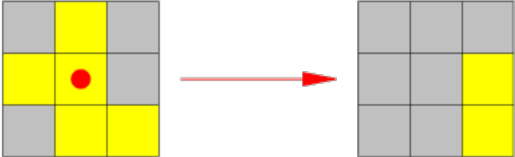
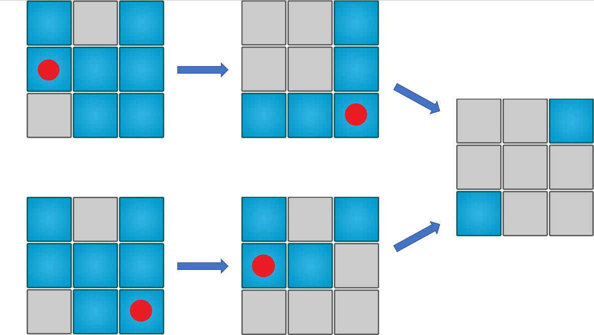

# Flip (Lights Out)

## 📝 فهرست 
 - [معرفی بازی](#معرفی-بازی)
 - [مهارت‌ها و مفاهیم درگیر در بازی](#مهارتها-و-مفاهیم-درگیر-در-بازی)
 - [حداقل تعداد حرکت‌های لازم](#حداقل-تعداد-حرکتهای-لازم)
 - [لینک منابع مفید](#لینک-منابع-مفید)

## معرفی بازی
این بازی متشکل از صفحه ای مستطیلی ست که در ابتدا
تعدادی از خانه های آن روشن هستند. در هر مرحله می توانید با انتخاب
یکی از خانه ها، حالت آن خانه و همسایه هایش را تغییر دهید. هدف بازی رسیدن به حالتی ست که تمام خانه ها خاموش باشند.

 

## مهارت‌ها و مفاهیم درگیر در بازی
 - تفکر قرینه بازی کردن
 - مفهوم زوجیت
 - پیدا کردن الگوها
 - برهان خلف و رسیدن به تناقض با فرض ولیه
 - اصل لانه کبوتری

# تحلیل بازی

## آیا همه حالت های اولیه قابل حل هستند؟
خیر! حالت هایی از شرایط اولیه وجود دارد که برایشان نمی توان هیچ راه حلی ارایه داد.  در بخش های بعدی این حالات را دقیق تر بررسی می کنیم.

## حداقل تعداد حرکت‌های لازم
اگر در کل طول بازی یک خانه را ۲ بار بچرخانیم به همان وضعیتی می‌رسیم که در آن بوده‌ایم و تفاوتی ایجاد نمی‌شود. در واقع ۱ بار چرخاندن با ۳، ۵، ۷ و ... بار چرخاندن یک خانه تفاوتی نمی‌کند؛ پس برای انتخاب راه حل نهایی‌مان برای هر خانه باید تصمیم بگیریم که آن را می چرخانیم یا خیر؟

با توجه به توضیحات بالا، می‌توانیم نتیجه بگیریم که «حداقل تعداد حرکت‌های لازم برای رسیدن به جواب» حداکثر به اندازه‌ی تعداد خانه‌های جدول است؛ به طور مثال برای یک جدول ۳*۳ حداکثر با ۹ حرکت می‌توان به جواب رسید. سوال اینجاست که کدامیک از خانه ها را باید چرخاند.

## ترتیب مراحل اهمیتی ندارد
بازی را از نگاه یکی از خانه ها تصور کنید. از دید این خانه، تمام مراحل به دو دسته تقسیم می شوند، مراحلی که در آنها حالت خانه ی مشخص شده تغییر می کند، و مراحلی که در آنها حالت این خانه تغییر نمی کند. در نهایت اگر تعداد زوجی از مراحل در دسته ی اول قرار گیرند خانه مشخص شده بی تغییر می ماند، و در غیر این صورت حالت آن عوض می شود(به عبارتی، از آنجا که تغییر ترتیب اجرای مراحل، تعداد مراحل اثرگذار را تغییر نمی دهد، روی نتیجه ی حاصل نیز اثری ندارد). این استدلال برای تمام خانه ها قابل تعمیم است.

 

## الگوریتم حل بازی

## لینک منابع مفید
 - https://gaming.stackexchange.com/questions/11123/strategy-for-solving-lights-out-puzzle
 - https://en.wikipedia.org/wiki/Lights_Out_(game)
 - https://github.com/bozbalci/flip
 - https://help.gnome.org/users/lightsoff/stable/strategy.html.en
 - https://www.jaapsch.net/puzzles/lomath.htm
 - https://www.youtube.com/watch?v=9aZsABF-Vj4
