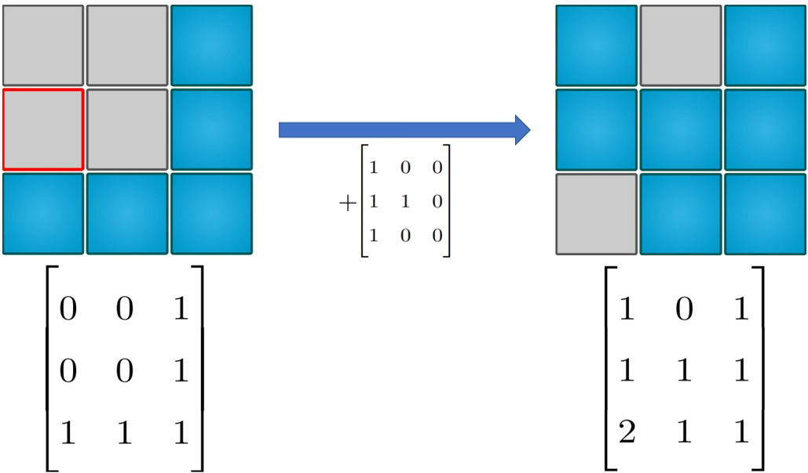
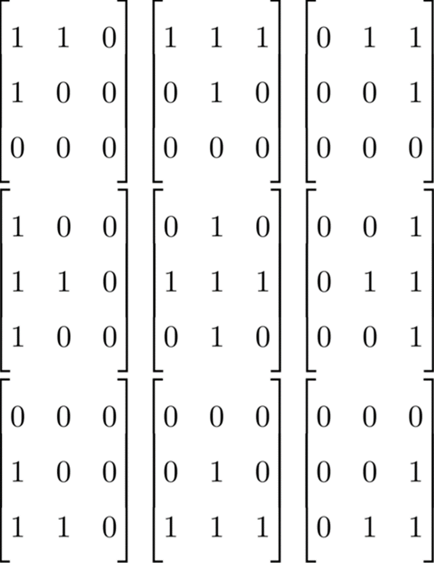
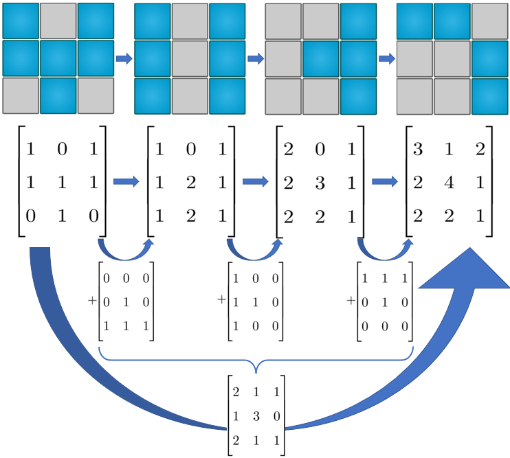
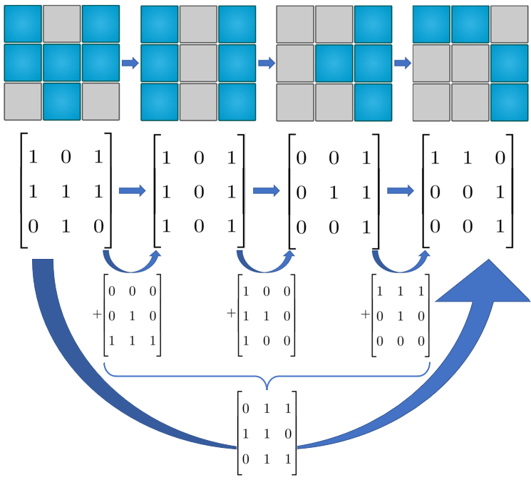
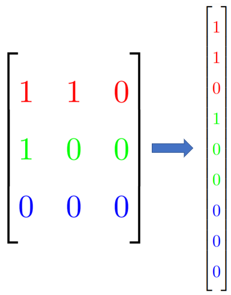
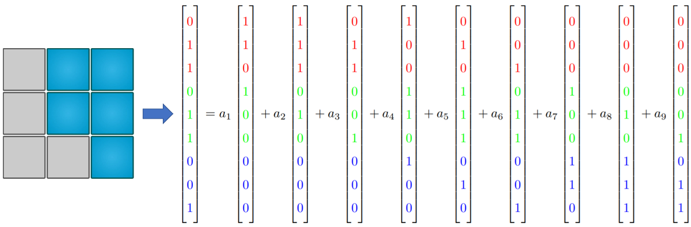

# Flip (Lights Out)

## 📝 فهرست 
 - [معرفی بازی](#معرفی-بازی)
 - [مهارت‌ها و مفاهیم درگیر در بازی](#مهارتها-و-مفاهیم-درگیر-در-بازی)
 - [تحلیل بازی](#تحلیل-بازی)
 - [الگوریتم حل بازی](#الگوریتم-حل-بازی)
 - [لینک منابع مفید](#لینک-منابع-مفید)

## معرفی بازی
این بازی متشکل از صفحه‌ای مستطیلی‌ست که در ابتدا تعدادی از خانه‌های آن روشن هستند. در هر مرحله می‌توانید با انتخاب یکی از خانه‌ها، حالت آن خانه و همسایه‌هایش رو تغییر دهید. هدف بازی رسیدن به خاموشی کامل است.

 

## مهارت‌ها و مفاهیم درگیر در بازی
 - تفکر قرینه بازی کردن
 - مفهوم زوجیت
 - پیدا کردن الگوها
 - برهان خلف و رسیدن به تناقض با فرض اولیه
 - اصل لانه کبوتری

## تحلیل بازی

### آیا همه حالت های اولیه قابل حل هستند؟
خیر! حالت‌هایی از شرایط اولیه وجود دارد که برایشان نمی‌توان هیچ راه حلی ارائه داد. در بخش‌های بعدی این حالات را دقیق‌تر بررسی می‌کنیم.

### حداقل تعداد حرکت‌های لازم
اگر در کل طول بازی یک خانه را ۲ بار بچرخانیم به همان وضعیتی می‌رسیم که در آن بوده‌ایم و تفاوتی ایجاد نمی‌شود. در واقع ۱ بار چرخاندن با ۳، ۵، ۷ و ... بار چرخاندن یک خانه تفاوتی نمی‌کند؛ پس برای انتخاب راه حل نهایی‌مان برای هر خانه باید تصمیم بگیریم که آن را می چرخانیم یا خیر؟

با توجه به توضیحات بالا، می‌توانیم نتیجه بگیریم که «حداقل تعداد حرکت‌های لازم برای رسیدن به جواب» حداکثر به اندازه‌ی تعداد خانه‌های جدول است؛ به طور مثال برای یک جدول ۳*۳ حداکثر با ۹ حرکت می‌توان به جواب رسید. سوال اینجاست که کدامیک از خانه ها را باید چرخاند.

### ترتیب مراحل اهمیتی ندارد
بازی را از نگاه یکی از خانه‌ها تصور کنید. از دید این خانه، تمام مراحل به دو دسته تقسیم می‌شوند، مراحلی که در آنها حالت خانه‌ی مشخص شده تغییر می‌کند، و مراحلی که در آنها حالت این خانه تغییر نمی‌کند. در نهایت اگر تعداد زوجی از مراحل در دسته‌ی اول قرار گیرند خانه مشخص شده بی‌تغییر می‌ماند، و در غیر این صورت حالت آن عوض می‌شود (به عبارتی از آنجا که تغییر ترتیب اجرای مراحل تعداد مراحل اثرگذار را تغییر نمی‌دهد، روی نتیجه‌ی انتهایی نیز اثری ندارد.). این استدلال برای تمام خانه‌ها قابل تعمیم است.

 

## الگوریتم حل بازی 

احتمالا تا الان خودتان هم به این نتیجه رسیده اید که هدف ما در بازی، پیدا کردن مجموعه ای از انتخاب هاست، که خانه های روشن را خاموش می کنند اما روی خانه های خاموش تاثیری ندارند(به عبارتی دیگر، باید تعداد مراحلی که خانه های خاموش را شامل می شوند زوج باشد، و تعداد مراحلی که خانه های روشن را شامل می شوند فرد باشد.).

یک راه مناسب برای توصیف هر مرحله، استفاده از ماتریس یک ها و صفرهاست(شکل زیر را ببینید.).

 

خانه های با عدد زوج خاموشند و خانه های با عدد فرد روشن هستند.

### توصیف ماتریسی انتخاب هر خانه 

 

### ترکیب انتخاب ها 
می خواهیم بر اساس توصیف ماترسی مراحل، نتیجه حاصل از انجام چند حرکت را بدست آوریم.

اگر صرفا ماتریس حرکات را با یکدیگر جمع کنیم، نتیجه حاصل نشاندهنده تعداد دفعات تغییر حالت هر کدام از خانه هاست. به مثال زیر توجه کنید
:

 

### تحلیل بر مبنای باقیمانده به 2 
همانطور که می بینید، در توصیف ماتریسی حالات، 0و 2و 4 و ... عملا یکسان هستند(همین استدلال برای اعداد فرد نیز برقرار است). بر اساس این دلیل، می توانیم تمام محاسبات را بر اساس باقیمانده به 2 ها تحلیل کنیم. برای مثال، مراحل تصویر قبل را می توان به این شکل در آورد:

 

### از 3,3 به 9,1
برای سادگی می توان برای هر حرکت به جای یک ماتریس 3 در 3 یک بردار 9 بعدی در نظر گرفت:

 

___
با توجه با توصیفات بالا، هدف ما در بازی، انتخاب تعدادی از بردارهاست به طوری که جمعشان با بردار حالت اولیه برابر باشد. به مثال زیر توجه کنید:

 

معادله بدست آمده یک [دستگاه معادلات خطی](https://fa.wikipedia.org/wiki/%D8%AF%D8%B3%D8%AA%DA%AF%D8%A7%D9%87_%D9%85%D8%B9%D8%A7%D8%AF%D9%84%D8%A7%D8%AA_%D8%AE%D8%B7%DB%8C) است که برای حل آن الگوریتم های بسیاری وجود دارد که از جمله آنها می توان به روش [حذف گاوسی](https://fa.wikipedia.org/wiki/%D8%AD%D8%B0%D9%81_%DA%AF%D8%A7%D9%88%D8%B3%DB%8C) اشاره کرد.

### چه حالاتی غیرقابل هستند؟ 

## لینک منابع مفید
 - https://gaming.stackexchange.com/questions/11123/strategy-for-solving-lights-out-puzzle
 - https://en.wikipedia.org/wiki/Lights_Out_(game)
 - https://github.com/bozbalci/flip
 - https://help.gnome.org/users/lightsoff/stable/strategy.html.en
 - https://www.jaapsch.net/puzzles/lomath.htm
 - https://www.youtube.com/watch?v=9aZsABF-Vj4
 - https://www.keithschwarz.com/interesting/code/?dir=lights-out
